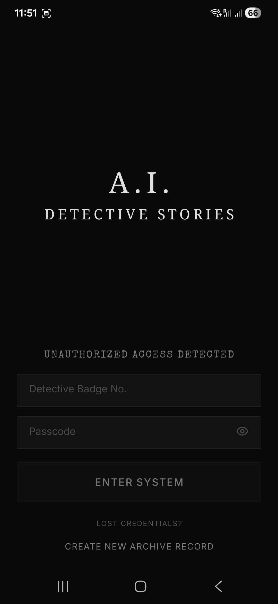
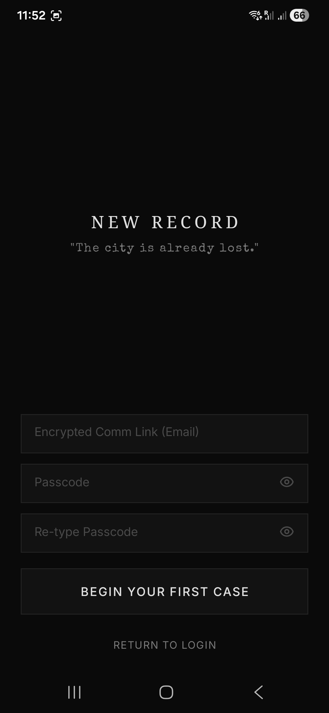
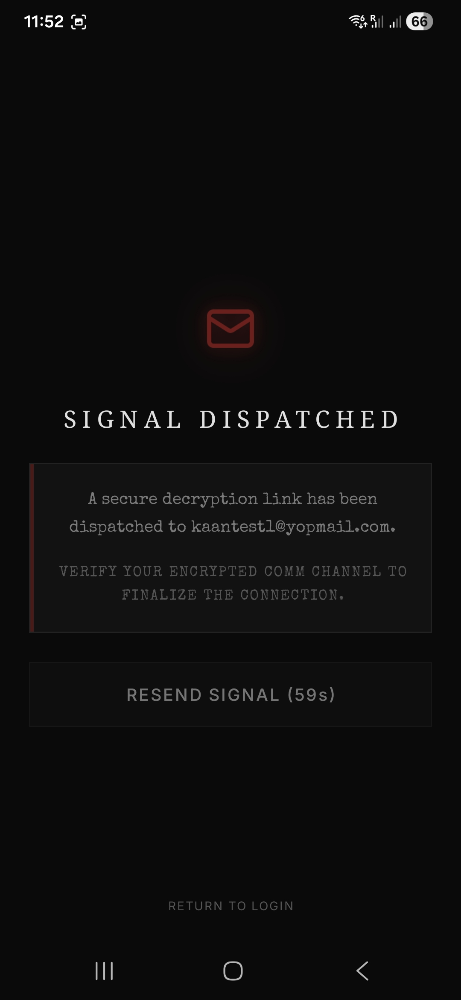
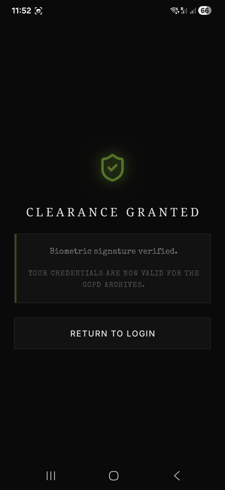
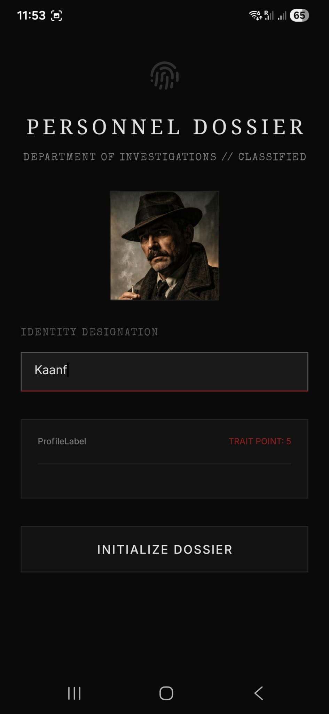
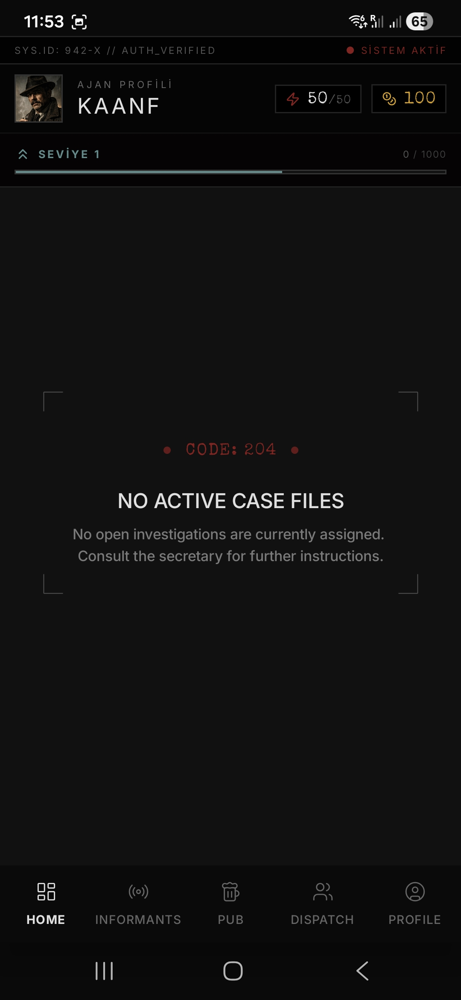
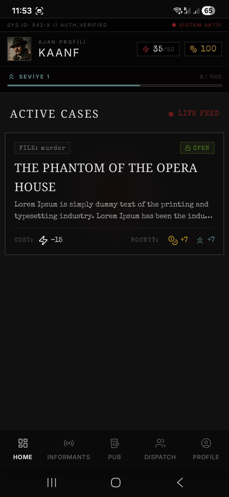
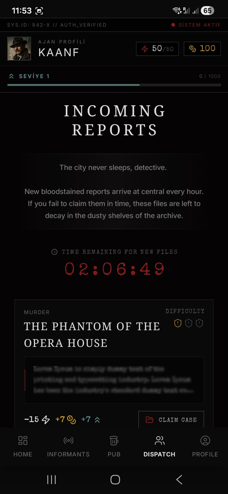
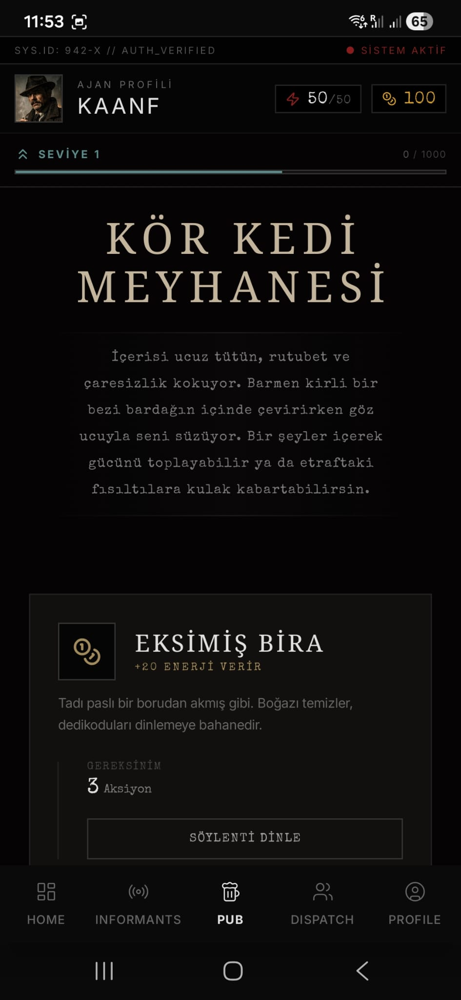

# Detective AI Stories

A story-driven detective app built on a modern Kotlin Multiplatform setup.
This repo splits `auth`, `character creation`, and `home` flows into separate modules while sharing UI and business logic across Android and iOS.

## Screenshots











## What This Project Is About

Looking at the structure, the app currently revolves around:

- sign up / login flows
- email verification and deep link handling
- avatar and trait-based character creation
- a dashboard / dispatch focused home experience
- a shared design system with feature-based modular architecture

## Tech Stack

- Kotlin Multiplatform
- Compose Multiplatform
- Compose Navigation
- Koin
- Ktor
- Room
- DataStore
- Ktlint
- Detekt

## Project Structure

```text
.
├── composeApp                # Main application entry point
├── core
│   ├── data                  # Shared data layer
│   ├── designsystem          # Theme and reusable UI components
│   ├── domain                # Domain models and contracts
│   └── presentation          # Shared presentation helpers
├── feature
│   ├── auth
│   │   ├── data
│   │   ├── domain
│   │   └── presentation
│   ├── character
│   │   ├── data
│   │   ├── domain
│   │   └── presentation
│   └── home
│       ├── data
│       ├── db
│       ├── domain
│       └── presentation
├── iosApp                    # iOS host app
└── build-logic               # Convention plugins
```

## Quick Start

What you need before running the project:

- JDK 17
- Android Studio
- Xcode

```bash
git clone <repo-url>
cd detective-ai-stories
```

## Running the App

### Android

To build a debug version:

```bash
./gradlew :composeApp:assembleDebug
```

If you prefer using the IDE, running the `composeApp` configuration is enough.

### iOS

Open the Xcode project:

```bash
open iosApp/iosApp.xcodeproj
```

Then run the app on a simulator or a physical device.

## Code Quality

This repo already includes a solid baseline for code quality:

```bash
./gradlew ktlintCheck
./gradlew detekt
./gradlew androidLint
./gradlew allTests
```

If you want a broader verification pass:

```bash
./gradlew check
```

## Release Note

Android release signing uses the following environment variables or Gradle properties:

- `DETECTIVE_STORE_FILE`
- `DETECTIVE_STORE_PASSWORD`
- `DETECTIVE_KEY_ALIAS`
- `DETECTIVE_KEY_PASSWORD`

If these values are missing, the project can still run normally in debug/development mode. Only release signing is skipped.

## Why This Setup Works

Because even when the product grows, the structure stays easy to reason about:

- `auth` lives in its own space
- `character creation` can evolve as a standalone feature
- `home` can expand with dashboard and dispatch style flows
- `core` keeps shared pieces from leaking everywhere

So adding new features does not immediately turn the repo into a maze.
